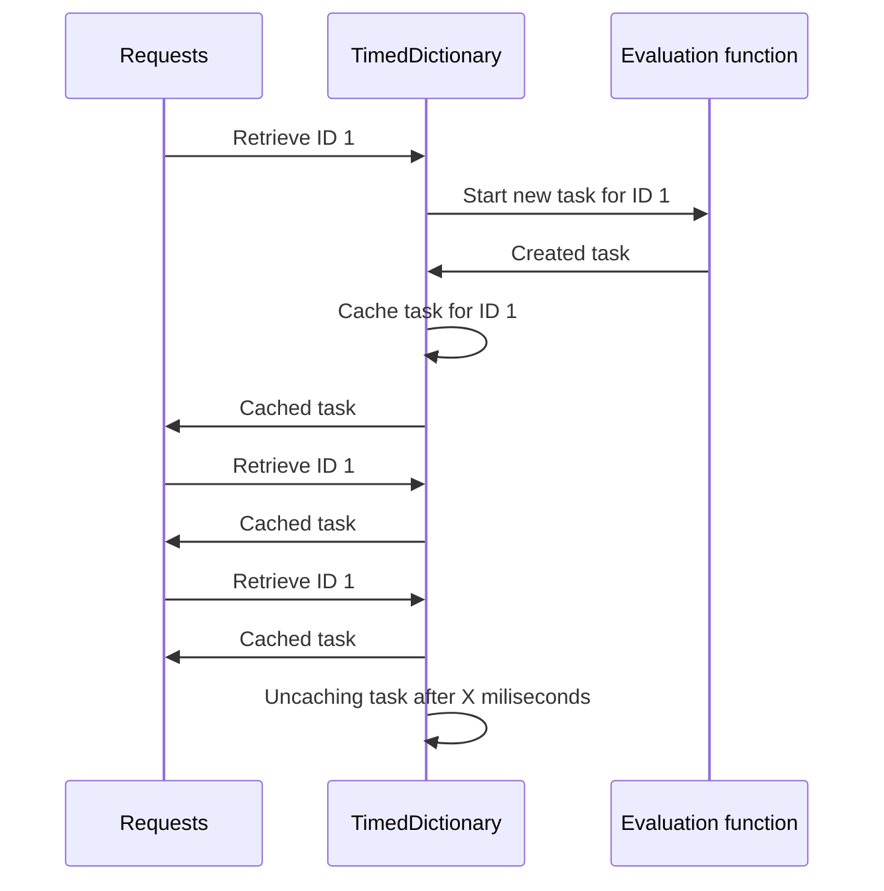

# TimedDictionary
The `TimedDicionary` and `TimedTaskDictionary` class is a time-based self-cleaning dictionary structure. 

Evaluation functions locks the TimedDictionary. For environments with high concurrency and long-running evaluations, consider using TimedTaskDictionary to wrap evaluations round Tasks.

Also important to note that this library does **not** dispose of any value when it times-out - the value is only removed from the dictionary.

## Parameters
Parameter | Description
--- | ---
expectedDuration | How many miliseconds each value should be kept in the dictionary. If null, the structure will keep all records until manually removed. Default: null
maximumSize | Maximum amount of values. When the limit is reached, no new object will be added, and keys that are not found will always execute the evaluation function. If null, there will be no limit to the dictionary size. Default: null
extendTimeConfiguration | Allows to configure time extension. This allows to increase each object lifetime inside the dictionry by X miliseconds, up to Y miliseconds, everytime the value is retrieved. If null, the object lifetime will obey the `expectedDuration` configuration. Default: null
dateTimeProvider | Mostly for test purposes, it allows the user to override how the current DateTime is calculated. Default: null

## Usage
### General example
```csharp
var dictionary = new TimedDictionary<Key, Value>();
var retrievedValue = dictionary.GetOrAddIfNew(key, () => GenerateValue());
```

### Configure to remove objects 5 seconds after they were added
```csharp
var dictionary = new TimedDictionary<Key, Value>(expectedDuration: 5000);
```

### Manually remove an entry
```csharp
var retrievedValue = dictionary.Remove(key);
```


## Recommended usage
### In-memory cache, keeping the most accessed values through refresh
```csharp
// Every time the entry is retrieved, the time is extended to another 30 seconds
// If the entry exists for 10 minutes, it's automatically removed
var config = new ExtendTimeConfiguration
(
    duration: TimeSpan.FromSeconds(30).TotalMilliseconds,
    limit: TimeSpan.FromMinutes(10).TotalMilliseconds
);

// Make the objects exist for 30 seconds by default
// Limit the cache size to 1M entries, to avoid memory overflow
var dictionary = new TimedDictionary<Key, Task<Value>>
(
    expectedDuration: TimeSpan.FromSeconds(30).TotalMilliseconds,
    extendTimeConfiguration: config,
    maximumSize: 1_000_000
);

var retrievedValue = dictionary.GetOrAddIfNew(key, () => GenerateValue());
return retrievedValue;
```

### Web - Bundle different requests into a single task
When multiple users request the same thing, instead of starting one task for each request, the TimedDictionary allows all the requests to await the same task. This helps avoiding redundant processing, like multiple database calls.

It is recommended to use TimedTaskDictionary instead of TimedDictionary, because it requires less boilerplate code to wrap around tasks.

```csharp
public async Task<IResult> GetAsync(
    [FromService]TimedTaskDictionary<Key, Value> singletonDictionary,
    [FromRoute]Key id)
{
    var task = singletonDictionary.GetOrAddIfNewAsync(key, () => RetrieveValueAsync(id));
    var result = await task;
    return Results.Json(result);
}
```



`TimedTaskDictionary.GetOrAddIfNewAsync` also has an additional parameter for AfterTaskCompletion, which can be configured to remove the entry from the dictionary right after the task is completed, if that's the desired behaviour.

```csharp
timedTaskDictionary.GetOrAddIfNewAsync(key, AsyncFunction, AfterTaskCompletionRemoveFromDictionary);
```